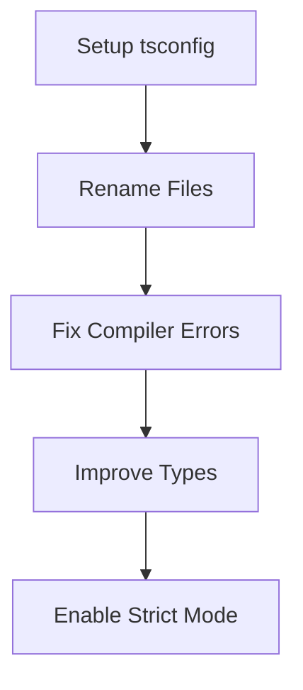

# JavaScript to TypeScript Migration

## Overview

This skill guides you through the process of migrating JavaScript code to TypeScript. The goal is to gain type safety without breaking existing functionality.

**Core Principle:** **Migrate iteratively.** Do not try to fix all types at once. First, get the compiler running, then tighten the rules.

## When to Use

- Converting `.js` / `.jsx` files to `.ts` / `.tsx`
- initializing TypeScript in a legacy JavaScript project
- Fixing type errors during migration

## Migration Workflow

## Step 1: Preparation (Configuration)

Before renaming files, rely on `allowJs: true` to let JS and TS coexist.

**REQUIRED RESOURCE:** Use `resources/tsconfig.migration.json` as a starting point. It is permissive by default.

## Step 2: Conversion Strategy

### File-by-File (Recommended)

Migrate one module at a time, starting from "leaf" nodes (utils, constants) up to "core" coding (components, business logic).

1. **Rename**: Change extension to `.ts` or `.tsx`.
2. **Suppress**: Use `// @ts-expect-error` or `any` TEMPORARILY for hard errors.
3. **Refine**: Replace `any` with specific types.

### Batch Conversion (Scripts)

For large codebases, use the provided scripts to automate renaming and basic report generation.

**TOOL:** `scripts/analyze-project.sh` - Checks ratio of JS to TS files.

## Handling Dependencies (The ".d.ts" Strategy)

**Scenario:** You are migrating `DomainLogic.ts`, but it imports `LegacyUtils.js`.
**Problem:** `LegacyUtils.js` has no types, causing errors or implicit `any`.
**Solution:** Do NOT migrate `LegacyUtils.js` yet (avoid "migration cascades"). Instead, create `LegacyUtils.d.ts`.

This creates a "Type Boundary". The new TS code gets safety, but the old JS code stays untouched.

**See Example:** `examples/declaration-boundary.md`

## Common Mistakes & Red Flags

| Mistake                                 | Reality                                                                                                |
| :-------------------------------------- | :----------------------------------------------------------------------------------------------------- |
| **"I'll verify logic while migrating"** | **STOP.** Logic changes mixed with migration cause subtle bugs. Keep logical refactoring SEPARATE.     |
| **Using `any` everywhere**              | Defeats the purpose. Use `unknown` or specific interfaces where possible. Limit `any` to "TODO" items. |
| **Ignoring `allowJs`**                  | trying to go 100% TS in one go leads to burnout and broken builds.                                     |

## Quick Reference

- **Check Status**: `bash scripts/analyze-project.sh`
- **Recommended Config**: See `resources/tsconfig.migration.json`
- **Example Pattern**: See `examples/migration-pattern.ts`

## Iron Law of Migration

**Functionality First, Types Second.**
If the migration breaks the app runtime, you have failed. The compiled output must behave exactly as the original JS.
